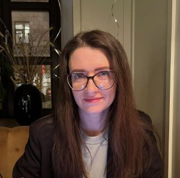

## Kate Borisovets

***
## Contacts
* __tel__ +48572120374
* **e-mail** kateboris.d@gmail.com
* **GitHub** [KateBoris](https://github.com/KateBoris)
* **location** POLAND
***
## About me
A humanitarian with a great desire to get into IT. I am sure that nothing is impossible, you just need to make an effort. I am able and like to work in a team, but sometimes it is easier for me to take responsibility and do the whole job myself.
***
## Code example
```
function multiply(a, b){
  return a * b; 
}
```
***
## Experience
I don't have any experience in development yet
***
## Education 
+ Belarusian State University
    * Business administration
+ ITsila
    * QA engineer
+ RS SCHOOL
    * JavaScript/Front-end Stage 0 (in process)
***
## Language
* English - A2 (and i continue to learn the language)
* Russian - native